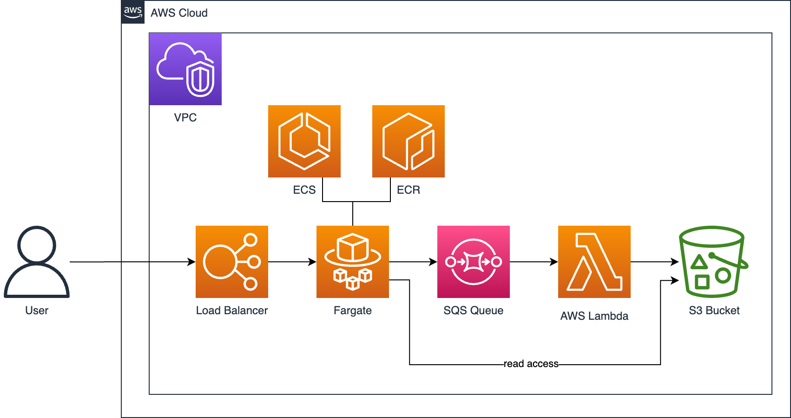

# C#/.NET in AWS

This is a sample repo to showcase how to use C# for applications and infrastructure in AWS. It contains a public facing web API, a Lambda function and the required infrastructure code for the AWS CDK to deploy and run the sample application.



## Prerequisites

* [AWS CLI](https://docs.aws.amazon.com/cli/latest/userguide/getting-started-install.html)
* [AWS CDK](https://docs.aws.amazon.com/cdk/v2/guide/work-with.html)
* [.NET 8 SDK](https://dotnet.microsoft.com/en-us/download/dotnet/8.0)
* [Docker](https://www.docker.com/products/docker-desktop/)
* AWS Account with admin privileges

## How to run

Deploy shared stack with ECR Repository, SQS Queue and S3 Bucket:

```shell
cdk deploy shared
```

Authenticate with ECR, then build & push to ECR, then deploy CDK:

```shell
aws ecr get-login-password --region eu-central-1 | docker login --username AWS --password-stdin 764102295437.dkr.ecr.eu-central-1.amazonaws.com

docker build -t meetup-webapi:latest --platform linux/arm64 src/Aws.Meetup.WebApi
docker tag meetup-webapi:latest 764102295437.dkr.ecr.eu-central-1.amazonaws.com/aws-meetup-dev-repository:latest
docker push 764102295437.dkr.ecr.eu-central-1.amazonaws.com/aws-meetup-dev-repository:latest

# Deploy
(cd src/Aws.Meetup.Cdk && cdk deploy webapi)
```

Build Lambda & deploy CDK

```shell
dotnet tool restore
(cd src/Aws.Meetup.Lambda && dotnet lambda package --output-package output/Aws.Meetup.Lambda.zip)

# Deploy
(cd src/Aws.Meetup.Cdk && cdk deploy lambda)
```

*Optional* Run WebAPI in Docker locally. This requires you to set the `AWS_ACCESS_KEY_ID`, `AWS_SECRET_ACCESS_KEY` and `AWS_SESSION_TOKEN` in your `.env` file like this:

`AWS_ACCESS_KEY_ID="<your-access-key-id>"`

Then run

```shell
docker compose up
```
